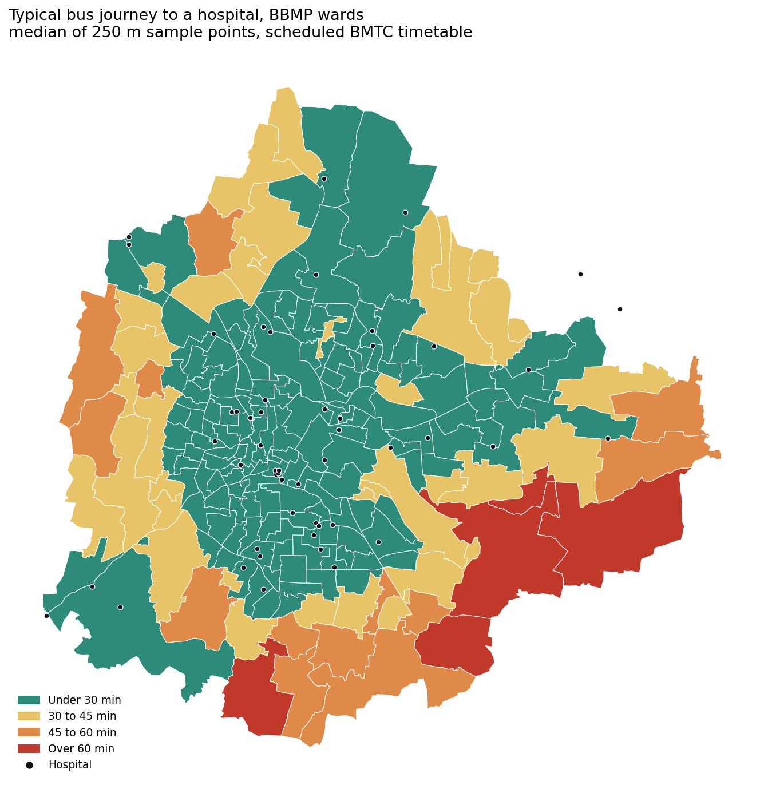
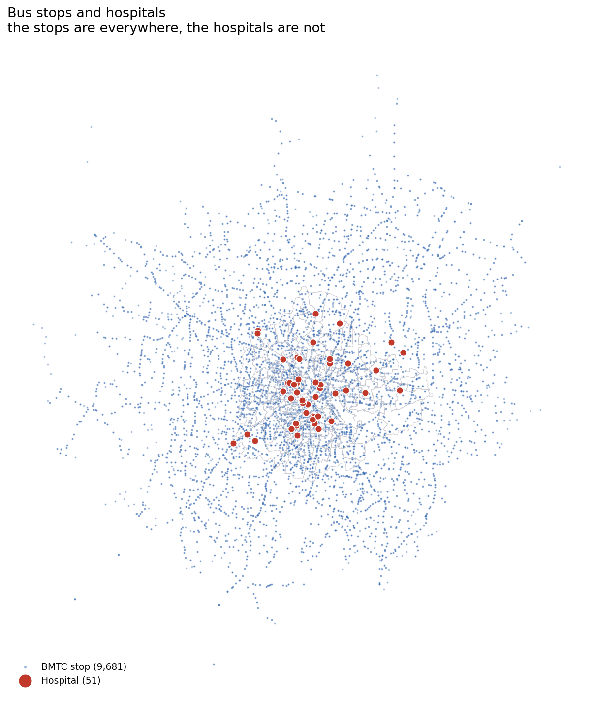

# How much of Bengaluru can reach a hospital by bus

**Dashboard: [yashasr21.github.io/bengaluru-bus-access](https://yashasr21.github.io/bengaluru-bus-access)**

Varthur ward is five kilometres from the nearest hospital. By bus, the typical
journey there is an hour and forty minutes. Fifty-four thousand people live in
that ward.

This project measures the trip rather than the map: for every one of
Bengaluru's 198 municipal wards, how long does it take to reach a hospital on
the buses that actually run?



---

## 1. The question

A city can have a lot of hospitals and still leave people stranded. What
matters to somebody without a car is whether there is a bus that gets them
there, how long it takes, and whether they have to change. That is a transport
question dressed as a health question, and it needs a transport dataset to
answer.

So: **which wards are badly served, how many people live in them, and is the
problem distance or is it routing?**

## 2. The data

| What | Source | Notes |
|---|---|---|
| Bus timetable | [Vonter/bmtc-gtfs](https://github.com/Vonter/bmtc-gtfs), feed version 20260712 | Unofficial GTFS build of the BMTC network, scraped from the Namma BMTC app. BMTC publishes no official feed. 9,887 stops, 4,381 routes, 56,856 trips, 1.52 million stop times. |
| Ward boundaries and population | [statsofindia/bbmp-delimitation-2022](https://github.com/statsofindia/bbmp-delimitation-2022) | The ward layer prepared for the 2022 BBMP delimitation. 198 wards, 8,443,675 people (Census 2011), 709 sq km. Boundary and population live in the same file, which removes the riskiest join in the project. |
| Hospitals | [Vonter/karnataka-social-services-data](https://github.com/Vonter/karnataka-social-services-data) | Facility layers scraped from the Karnataka GIS portal (KGIS / KSRSAC). 683 candidate facilities across eight layers. |

Everything is open data and `scripts/00_download_data.py` fetches all of it.

**What counts as a hospital.** This is the judgement call in the project, so
the rule is written down rather than left in the code. In: places that admit
patients overnight or run an emergency room — district hospitals, taluk
hospitals, community health centres, tertiary centres, specialty hospitals,
teaching hospitals and trauma centres. Out: primary health centres and urban
PHCs, sub-centres, wellness centres, standalone labs, scanning centres,
pharmacies, ambulance parking points and training institutes. A primary health
centre is a real and useful thing; it is not where you go at 2 a.m. with a
broken arm.

I wanted to weight hospitals by bed count. The `BedCount` column exists in the
source and is zero in every row, so every hospital counts equally instead.

683 candidates became **51 hospital sites** after clipping to BBMP plus a 3 km
ring and de-duplicating. All 632 removals are logged with a reason in
`data/processed/hospitals_dropped.csv`, e.g. *"Victoria Hospital, Bengaluru
Urban — same name as 'Victoria Hospital' (432 m apart)"*.

## 3. The method

Every journey is built the way a passenger experiences it:

```
walk to the stop  +  wait  +  ride  +  (change)  +  walk to the hospital gate
```

- **Walking** at 4.8 km/h, within a 500 m straight-line catchment of a stop.
- **Waiting** is half the average headway on the pattern, capped at 20 minutes.
- **Riding** uses the scheduled times in the feed.
- **Changing** costs a flat 8 minutes, once. Two changes are not allowed.

The 56,856 trips collapse into 7,182 route patterns — one per route, direction
and stop sequence — which is twenty times less work and loses nothing, because
frequency comes back as headway.

The search runs backwards, which is what makes it cheap. Instead of routing
every stop to every hospital, each pattern is walked from its last stop to its
first, carrying a running minimum of "time here plus the cost of finishing from
here". Two passes over the feed give every stop its best one-bus and best
one-change journey. The whole thing runs in about ten seconds.

Ward scores come from covering each ward with sample points 250 metres apart —
11,345 of them — routing each point separately, and taking the ward's median.
A point with no journey is charged the three-hour ceiling rather than dropped,
because dropping unreachable points quietly rewards the worst wards. The median
rather than the centroid, because wards here run from 0.32 to 29.6 sq km and
some have a two-hour gap between their best and worst corner.

`scripts/quality_checks.py` runs 18 assertions over the output — ward count,
population total, city area, monotonicity of the sensitivity runs, and so on.
All 18 pass. Six of them were written after something went wrong; see
`notes.md`.

## 4. What it found

**1,033,678 people — 12.2% of Bengaluru — live in a ward where the typical bus
journey to a hospital is 45 minutes or more.** 291,185 of them are over an
hour. Eighteen wards are in that group and every one of them is on the outer
ring, mostly east and south-east.

Two thirds of the city, 5,790,535 people, are within half an hour. That is real
and it should be said first.

| band | wards | people | share |
|---|---|---|---|
| Under 30 min | 149 | 5,790,535 | 68.6% |
| 30 to 45 min | 31 | 1,619,462 | 19.2% |
| 45 to 60 min | 13 | 742,493 | 8.8% |
| Over 60 min | 5 | 291,185 | 3.4% |

**Distance is not the whole story.** Marathahalli is 3.2 km from a hospital and
takes 71 minutes to reach one — the bus loses to a person walking in a straight
line by a factor of 1.76. Nayandahalli is 4.3 km away and takes 35 minutes,
because one route runs the whole way. A single good route is worth more than
two kilometres.

**A third of the network only works by changing buses.** 2,926 stops (30.2%)
have no single bus to a hospital; those journeys average 91 minutes. Another
397 stops have no bus journey to a hospital at all.

**Two thirds of BMTC's route patterns run fewer than four times a day.** Under
7% run every half hour or better. This is the number that surprised me most,
and it is why the 20-minute cap on waiting is doing so much work.

Full tables and interpretation: [`sql/findings.md`](sql/findings.md).



The interactive map has the bus stop layer as a toggle. Switching it on is the
quickest way to see why a ward is red: in Varthur the stops are there, they
just do not go anywhere useful.

## 5. What this cannot tell you

Four limitations, and all four push the same way — the real journey is worse
than the modelled one.

1. **Scheduled times, not real ones.** Bengaluru traffic is not in the data.
   A 40-minute journey at 9 a.m. is optimistic, and the error grows on the
   long peripheral routes where the finding lives.
2. **Walking is measured as a circle, not along roads.** Lakes, railway lines,
   the ORR and missing footpaths all make the real walk longer. Detour factors
   of 1.2 to 1.4 are typical, so a 500 m circle is nearer a 400 m walk.
3. **Hospital coverage is incomplete.** The Karnataka layers cover government
   facilities and empanelled tertiary centres. Much of the private sector is
   missing, and it is not missing evenly — it clusters where the money is.
4. **Ward population is assumed to be spread evenly.** In Varthur it is not:
   people cluster along the main roads, which is also where the buses are. This
   one probably makes the finding look worse than it is, unlike the other three.

The assumption the result is most sensitive to is the 500 m catchment. At 800 m
the affected population falls from 1.03 million to 564,050. Restricting to
routes that run at least every half hour pushes it up to 1.59 million. Both are
in the sensitivity table on the dashboard rather than only the flattering one.

## 6. Running it

```bash
git clone https://github.com/yashasr21/bengaluru-bus-access
cd bengaluru-bus-access
pip install -r requirements.txt

cd scripts
python run_all.py          # about a minute, downloads ~45 MB on first run
```

Then open `docs/index.html`.

Individual steps, all runnable on their own:

| script | does |
|---|---|
| `00_download_data.py` | fetches the three raw datasets |
| `01_prepare_wards.py` | ward boundaries and population |
| `02_prepare_hospitals.py` | the hospital list and the inclusion rule |
| `check_alignment.py` | draws all three layers together before any analysis |
| `03_bus_network.py` | GTFS into route patterns and headways |
| `04_journey_times.py` | journey time from every bus stop |
| `05_ward_access.py` | grid sampling and ward scores |
| `06_maps.py` | interactive map and three stills |
| `07_build_database.py` | SQLite file for the queries in `sql/` |
| `08_build_dashboard.py` | builds `docs/index.html` |
| `quality_checks.py` | 18 assertions over the output |
| `fetch_osm_hospitals.py` | optional: adds OpenStreetMap hospitals |

Every assumption in the model lives in `scripts/settings.py`. Dead ends and
things that broke are in [`notes.md`](notes.md).

---

Data under the licences of the sources above. BMTC GTFS and the Karnataka
layers are unofficial scrapes; treat them as indicative, which is how this
analysis treats them.
